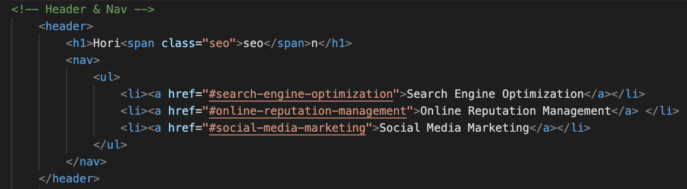

# Colin Whitcomb
* Homework 1_v2
* June 11th, 2020
---
## Summary 

In this assignment, our objectives included:
1) Restructuring HTML with semantic elements
2) Ensuring both HTML and CSS are built with logical structure
3) Adding alt attributes to images 
4) Ordering headings sequentially
5) Altering the title to be more descriptive

---
## Technologies Used
- Visual Studio Code
- Git / GitHub / GitPages
- HTML 
- CSS 
---

## Process

 To complete this assignment I worked sequentially through the list provided in the summary. I worked top down adding HTML semantic elements while adjusting the correlating CSS. Afterwards, I condensed some lines of CSS to be structured togeter (see screenshot 1). 
 
 The following steps were more straight forward. I added descriptions in alt attributes, changed the footer h2 tag to h4, and changed the title to "Horiseon - Web Marketing."

---
## Screenshots

1. **Inline CSS classes with similar attributes.** 

2. **Repositioned the li and a tags in-line for aesthic grouping. Included comments to be transparrent on overall structure.**

---
## My Links

1) https://github.com/Colin-Whitcomb/homework1-v2

---